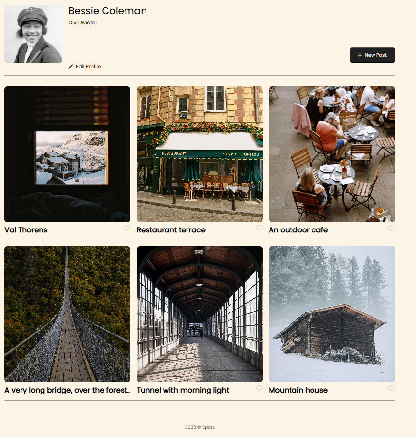

# Project 3: Spots / Spots: project 4, stage 2 opening and closing the modals

Sprint 3 - Final Project - Spots myvideo link: https://drive.google.com/file/d/1dAbtD1K8aMwfXTZzYSfPKJHq3MNBF8yN/view?usp=sharing

### Overview

1.The project's name
Spots Web Page

This project is made so all the elements are displayed correctly on popular screen sizes. We recommend investing more time in completing this project, since it's more difficult than previous ones.

**Intro**

- Intro

  2.A description of the project and its functionality
  The web page is an interactive social media-web application called "Spots". It allows users to view photo cards, like them, and features user profile information with options to edit the profile or add new posts. It’s designed responsively to work well on desktops, tablets, and phones.

  3.A description of the technologies and techniques used
  HTML
  CSS
  GIT BASH TERMINAL
  VS Code
  The card layout uses CSS Grid
  Project changes for the tablet and phone resolutions using Media queries.

      Semantic tags used include:
      • <header> – for logo/navigation
      • <main> – for main content
      • <section> – for distinct sections (profile, cards)
      • <footer> – for the bottom branding/info

  BEM methodology
  • Block – a standalone component (e.g., card, profile)
  • Element – part of a block (card**image, profile**name)
  • Modifier – a variation of a block/element (not heavily used here, but would look like card\_\_image--large)

  File Structure & Naming:
  CSS is split into separate files for each block (e.g., card.css, footer.css), maintaining clarity and scalability.

  normalize.css ensures consistent rendering across browsers before custom styles.
  Fonts must load early to ensure consistent typography.
  • Using @font-face to load local .ttf files
  • Fallbacks include Arial, Helvetica, and generic sans-serif to ensure compatibility.

**Images**

The way you'll do this at work is by exporting images directly from Figma — we recommend doing that to practice more. Don't forget to optimize them [here](https://tinypng.com/), so your project loads faster.

4.Pictures, GIFs, or screenshots that detail the project features (highly recommended)
[text](spots-images)

5.The link to your deployed project on GitHub Pages
This webpage is deployed to GitHub Pages

[Deployment link:](https://abasaneznanez.github.io/se_project_spots/)

- Images
  [text](spots-images)

**Figma**

- [Link to the project on Figma](https://www.figma.com/file/BBNm2bC3lj8QQMHlnqRsga/Sprint-3-Project-%E2%80%94-Spots?type=design&node-id=2%3A60&mode=design&t=afgNFybdorZO6cQo-1)

Good luck and have fun!
